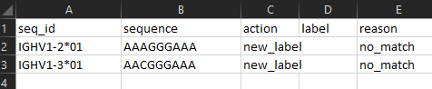

# IgLabel
## Manage allocation of temporary labels for IG alleles

This script will allocate 'temporary labels' for newly discovered IG alleles in accordance with 
the schema and process defined by the 
[Germline Database Working Group](https://www.antibodysociety.org/the-airr-community/airr-working-groups/germline_database/) 
of the 
[AIRR Community](https://www.antibodysociety.org/the-airr-community/). This is an experimental 
work-in-progress.

Draft documents omn which it is based:

Outline schema for germline database management: 
- [document](), [schema]() (links not working as yet, to be updated)
- [Specification for this script](https://docs.google.com/document/d/1Top32CXCL2uOyjfHl54ebJEG43Jnc2oAoRjq5e6niEA/edit?usp=sharing)

## Installation

The script requires Python 3.6 or later, with BioPython installed. Clone the repo to your workstation to use it.

## Usage

The script supports three commands: `create`, `query`, `add`:

```commandline
usage: iglabel.py [-h] {create,query,add} ...

Manage allocation of temporary allele labels within a species or strain

positional arguments:
  {create,query,add}  Desired action to perform
    create            Create database
    query             Query database
    add               Add sequences to database

optional arguments:
  -h, --help          show this help message and exit
```

## Example Usage
For a brief tour of its capabilities, open a command prompt and cd to the directory IgLabel/test.

The script is intended to maintain a database for a specific strain or species. You can give 
the database any name you want, as long as it is a valid filename. As the database is a CSV file,
it's convenient to give it a name ending in .csv.  You create a new database with the 
`create` command:

```commandline
IgLabel\test>python ..\iglabel.py create mouse_b6.csv
Creating database "mouse_b6.csv"
Database created.
```

The `query` command takes a set of sequences, in a FASTA file, and checks them against the database.
It produces a summary file, listing sequence matches and non-matches, and an actions file, which 
lists the suggested actions, where necessary, to add the sequences to the database and generate
new labels as required. The file seq1.fasta contains two (very short and simple) sequences. 

```commandline
usage: iglabel.py query [-h] database_file query_file result_file action_file

positional arguments:
  database_file  allocation database
  query_file     list of sequences to query (FASTA)
  result_file    list of results (CSV)
  action_file    list of results (CSV)

optional arguments:
  -h, --help     show this help message and exit
```
```commandline
IgLabel\test>python ..\iglabel.py query mouse_b6.csv seq1.fasta results.csv actions.csv
Querying database "mouse_b6.csv" for sequences in "seq1.fasta"
```
Here is the results file:


And the actions file:



As the database is empty at the moment, the results file tells us that neither
sequence has a match in the database, and the action file suggests that both should be added
(the action `new_label` will instruct IgLabel to create new temporary labels for a sequence in the next step,
and the reason `no_match` explains that IgLabel is suggesting this because there is no match
to an existing sequence in the database).

Let's go ahead and apply these actions to the database, using the add command:

```commandline
IgLabel\test>python ..\iglabel.py add -h
usage: iglabel.py add [-h] database_file action_file contributor

positional arguments:
  database_file  allocation database
  action_file    list of actions to carry out (from iglabel.py query)
  contributor    Name of contributor

optional arguments:
  -h, --help     show this help message and exit
```
```commandline
IgLabel\test>python ..\iglabel.py add mouse_b6.csv actions.csv "Fred Smith"
Database written to mouse_b6.csv. Previous version saved as mouse_b6_old.csv
```

Notice that the add command is supplied with the name of the contributor of the sequence. This allows
a later researcher to contact the contributor if there is a need to understand the origin of the
sequence. Notice also that whenever the database is updated, a backup copy is saved. This allows
you to reverse out the latest set of changes by renaming the file.

You can see what's in the database, by opening mouse_b6.csv:


IgLabel has added labels for the two sequences. Because the specification allows for subsets and
supersets of a sequence to share the same label if they are thought to represent the same allele,
several sequences can be listed in column B. Column C always lists the longest of these.

Let's run another query now. This time we'll include the original sequences again, 
and a subset of one, and a superset of the other.

```commandline
IgLabel\test>python ..\iglabel.py query mouse_b6.csv seq2.fasta results.csv actions.csv
Querying database "mouse_b6.csv" for sequences in "seq2.fasta"
```

Results file:


Actions file:


This time, the query has found an exact match to the first two sequences, and so reports that no 
action is required for them. It sees that one of our sequences is a sub-sequence of label WU6M,
and the second is a super-sequence of 5VVQ. It suggests actions to add these appropriately, but, if
you wished, you could modify these actions, for example changing them to `new_label` instead, if
there was reason to believe that the sequences represented separate alleles, or even to `none` if 
you did not wish to add them at all (the system will, however, check to make sure that anything
added with `add_new_subset` or `add_new_superset` is a genuine sub-sequence or super-sequence!).

Using the Add command again produces the following database file, in which we can see the way that multiple 
sequences can be referred to by a single label:

```commandline
IgLabel\test>python ..\iglabel.py add mouse_b6.csv actions.csv "Fred Smith"
Database written to mouse_b6.csv. Previous version saved as mouse_b6_old.csv
```


Finally, running Query again tells us that all these sequences are accounted for, and suggests
no actions:

```commandline
IgLabel\test>python ..\iglabel.py query mouse_b6.csv seq2.fasta results.csv actions.csv
Querying database "mouse_b6.csv" for sequences in "seq2.fasta"
```

Results file:


Actions file:


